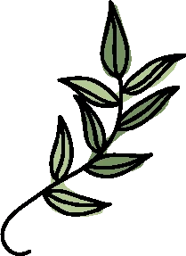

# varpu
A simple yet powerful geometry library for Java.

## Usage
Varpu supports arbitrary vector spaces, but built-in
implementations exist for ℝ³ (3D) and ℝ⁴ (4D) via the Ternion and
Quaternion classes, respectively. A default implementation
for orthotopes in ℝ³ (3D boxes) also exists.
All of the above are used here:
```java
import blue.lhf.varpu.vector.*;
import blue.lhf.varpu.polyhedra.*;

import static java.lang.Math.*;
import static java.lang.System.err;
import static blue.lhf.varpu.polyhedra.Box.*;
import static blue.lhf.varpu.vector.Ternion.*;
import static blue.lhf.varpu.vector.Quaternion.*;

// A 10-by-10-by-10 box with a 45-degree clockwise roll.
Box box = Box.empty()
    .centred(ternion(0, 0, 0))
    .sized(ternion(2, 2, 2))
    .rotated(euler(0, 0, toRadians(-45)));

box = box.rotated(euler(0, 0, toRadians(45)));
err.println(box.isSimilar(box(ternion(-1, -1, -1), ternion(1, 1, 1)), 0.1));
```
